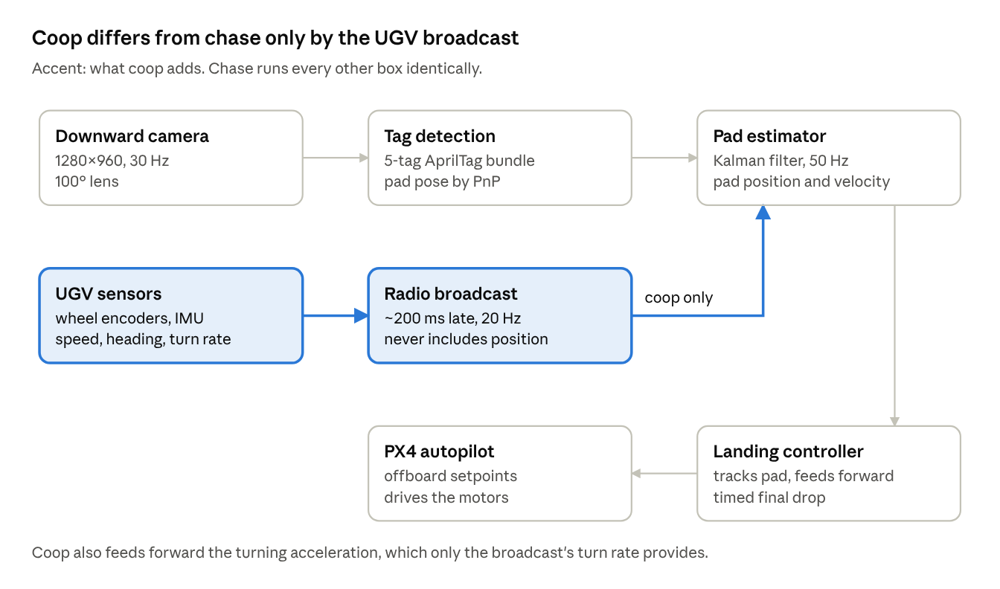
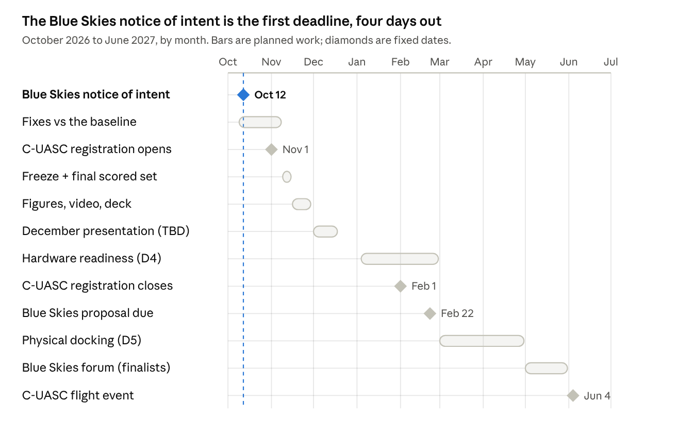

# Cooperative UAV–UGV Docking: Status and Plan

*Docking team · RSCL@CPP Project 2 · status as of October 8, 2026*

The shared overview of where the project stands, what it has shown so far, and what comes next: a starting point for everyone on the team. The detail behind every number lives in the code repository (see Sources).

## Summary

When the ground robot shares its motion over a radio link, the drone lands on a turning pad that a camera-only drone never lands on. In the first scored test (simulation, 1.0 m/s, 20 paired trials per path), the cooperative drone docked **11 of 20 times on a constantly turning path and 7 of 20 on a path with sharp corners; the camera-only drone docked 0 of 20 on both.** Both differences are statistically significant (exact McNemar test, p = 0.001 and p = 0.016).

This is the project's moving baseline, not its final result. Everything so far is simulation (PX4 autopilot and Gazebo). The scored flights use GPS; nothing here claims GPS-denied flight. Hardware begins in January.

Three decisions are needed now:

1.  **Submit the NASA Gateways to Blue Skies notice of intent by October 12.** It is non-binding and keeps the best-fitting competition open.

2.  **Confirm the ground robot:** reuse a lab platform (the AVL or IGVC robot) or buy or build one.

3.  **Choose the ground-truth method for spring:** motion capture, an overhead camera, or RTK GPS. Without one, hardware landings cannot be scored.

## Research question, hypothesis and metrics

**Question (from the RSCL project page):** can both the UAV and the UGV cooperate to reduce relative landing error, instead of forcing the UAV to chase a passive moving target?

**Hypothesis:** a cooperative controller, in which the UGV broadcasts its velocity and heading and the UAV fuses that with its camera's view of the landing pad, achieves lower touchdown error and higher docking success at higher speeds than a UAV-only "chase" controller.

| Metric                          | Unit                                                                 | Role       |
|---------------------------------|----------------------------------------------------------------------|------------|
| Touchdown position error        | cm, from the pad centre at contact                                   | Primary    |
| Docking success                 | % of trials inside the 10 cm tolerance and resting fully on the deck | Primary    |
| Maximum reliable platform speed | m/s                                                                  | Supporting |
| Settling time                   | s, from the pad starting to move until touchdown                     | Supporting |
| Disturbance tolerance           | latency, noise and dropout on the link                               | Supporting |

## Approach

**Simulation first, hardware second.** The whole comparison runs in PX4 software-in-the-loop with Gazebo, where ground truth is exact. Spring hardware tests whether the simulated result transfers; it does not replace it.

**Two strategies, everything else identical:**

- **Chase:** the drone sees the pad with a downward camera (an AprilTag bundle on a 0.6 m deck) and estimates its position and velocity from the camera alone.

- **Coop:** the same, plus the UGV's broadcast of its speed, heading and turn rate. The broadcast never includes position. It arrives 200 ms late by default, and can be degraded with noise, bias and dropout, so coop cannot win on perfect information.

**Gates, each passed before the next is attempted:** the tag gives a pose (D0); the pad robot drives its path (M0); the drone holds over the pad (H0); lands on a static pad (D1); the chase baseline lands on a moving pad (D2); chase vs coop (D3, the Fall result); then hardware readiness (D4) and transfer (D5).

**Rules that make the comparison fair:**

- **Paired trials.** Chase trial n and coop trial n share the start position and the broadcast seed. A trial counts only if the pad was really moving at contact and the rig worked.

- **Thresholds fixed before flying.** The 10 cm tolerance came from the landing-skid geometry before the first landing, and has never moved.

- **A test for every scorer, written first.** Each scorer is run on synthetic trials with known answers before it scores anything real.

- **Chase must never hear the broadcast.** This is checked in every chase trial, not trusted to configuration.

- **Tuning and scoring stay separate.** Controller settings are chosen on one set of start positions (seed 1) and scored on another (seed 2).

## How the system works

The camera path is the same for both strategies. Coop adds the UGV's broadcast, which corrects the estimated pad velocity and supplies the turn rate, so the controller can anticipate turns instead of reacting to them.

## Results

Every gate through D2 has passed, and D3 has its first scored cells. All results are from simulation.

| Gate | Question                                         | Result                                                                |
|------|--------------------------------------------------|-----------------------------------------------------------------------|
| D0   | Does the tag give a usable pose?                 | Pass: accurate from touchdown to 2.5 m (p95 2.3 cm, 1.1°) at 1280×960 |
| M0   | Does the pad robot drive its path?               | Pass: 15 of 15 path/speed cases, position p95 within 2.4 cm           |
| H0   | Can the drone hold over the pad by camera alone? | Pass: hold p95 within 2.8 cm at three heights                         |
| D1   | Can it land on a static pad, repeatably?         | Pass: 20 of 20, touchdown error median 1.2 cm, max 2.7 cm             |
| D2   | Can the chase baseline land on a moving pad?     | Pass: 20 of 20 at 0.5 m/s, median 2.1 cm                              |
| D3   | Does cooperation help, at speed?                 | First scored cells below                                              |

**D3 baseline** (run 20261007_135910): 1.0 m/s pad speed, 200 ms link, 20 paired trials per path, fresh start positions never used for tuning.

| Path                                        | Chase docked        | Coop docked        | Coop docked, chase did not | Chase docked, coop did not | Exact McNemar p |
|---------------------------------------------|---------------------|--------------------|----------------------------|----------------------------|-----------------|
| Sine (always turning, smoothly)             | 0/20 (95% CI 0–16%) | **11/20** (34–74%) | 11                         | 0                          | **0.001**       |
| Rounded square (a sharp corner every 5.6 s) | 0/20 (0–16%)        | **7/20** (18–57%)  | 7                          | 0                          | **0.016**       |
| Line (no turns; the control, 20 pairs)      | 19/19 valid         | 20/20              | 0                          | 0                          | —               |

In 40 pairs on turning paths, chase never docked when coop failed. On the line, where the camera alone is enough, both dock every time, so coop's advantage appears exactly where the hypothesis says it should: in turns. Coop touched down on all 20 sine trials (median 8.2 cm from centre) and on 15 square trials (median 5.9 cm).

One line trial (chase, trial 01) is excluded twice over: from its start position, a rotor brushes the stationary pad during takeoff, which the scorer correctly treats as an invalid trial. A scorer rule for contacts before the pad moves is proposed, not yet adopted.

## What we learned building it

Each of these changed the design, and each was found by measurement rather than assumed.

1.  **A better velocity estimate alone landed nothing; feeding forward the turn's acceleration did.** The broadcast made coop's estimate of the pad's velocity about five times more accurate than chase's, yet both failed on the sine: in every turn the drone fell about 45 cm behind its own target, because the autopilot was given position and velocity but no acceleration. Feeding forward the turning acceleration (turn rate × speed, which only coop knows) cut the offset from about 47 cm to 19 cm (95th percentile).

2.  **A simulator setting had capped every descent.** The autopilot's saved parameters still held a 0.2 m/s descent limit set during the first gate, so every landing in D1–D3 descended at 0.2 m/s, not the documented 0.3. The recorded results stand as what the drone did; the runner now sets and records every flight parameter on every trial.

3.  **Timing the final drop matters more than its speed.** A faster final half-metre alone did not help. Starting the fast drop only when the pad's turning is gentle or easing (information only coop has) took the sharp-cornered path from 0 of 6 to 3 of 6 in early tests, and is the controller in the baseline.

4.  **Coop's largest failure is not a missed landing.** Six coop landings were inside the tolerance at contact but ended with a landing-skid corner 0.5–1.3 cm over the deck edge. Five of the six skidded 3–10 cm in the third of a second between contact and disarm, while still armed with near-hover thrust, as the pad turned beneath them (correlation with the pad's turning: 0.87). After disarm they did not move. The fix is to cut thrust at contact, which is also a hardware requirement: real systems cut motors the moment the deck is detected.

5.  **Two attempted fixes failed and are recorded as failures:** holding the descent during turns (the drone sank past its frozen target) and a first version of the timed drop (it stalled mid-drop).

## Limitations

- **Simulation only.** The simulated camera has no rolling shutter or motion blur, the ground is flat, and the pad's motion is scripted. Hardware may behave differently; that is what D5 tests.

- **One speed and one link so far:** 1.0 m/s and a 200 ms, noiseless link. The planned 1.5 m/s cells and the latency sweep are not flown.

- **The chase baseline has no turn model.** A reviewer could argue chase lost because it assumes straight-line motion. A chase variant that estimates turn rate from the camera is planned before any final claim.

- **Designed paths.** On campus the UGV would drive around obstacles with no fixed route. The core coop broadcast does not depend on a known route, but the paths flown so far are designed ones.

- **Not GPS-denied.** The scored flights use GPS. The GPS-denied layer is a separate, unfinished research track.

- **20 trials per cell** gives wide confidence intervals (for coop on the sine, 34–74%). The direction of the result is clear; its exact size is not.

## Competitions

**Recommendation: NASA Gateways to Blue Skies 2027 as the primary competition, with C-UASC 2027 as an optional flight competition for the airframe.** Both are on the RSCL list. Checked against each competition's own pages on October 8, 2026.

| Competition (RSCL list)                                                                  | What it asks for                                                                                                                                                      | Fit with docking                                                                                                                                                                     | Status                                                                                                                                                                                                        |
|------------------------------------------------------------------------------------------|-----------------------------------------------------------------------------------------------------------------------------------------------------------------------|--------------------------------------------------------------------------------------------------------------------------------------------------------------------------------------|---------------------------------------------------------------------------------------------------------------------------------------------------------------------------------------------------------------|
| **NASA Gateways to Blue Skies 2027, "InfraAir: Aviation for Infrastructure Inspection"** | A concept competition: 5–7 page proposal and 2-minute video; finalists write a paper and present in May 2027. No hardware                                             | **High.** An inspection drone that docks on a moving ground support vehicle to recharge or hand off data along a bridge or road corridor. The simulation results support it directly | Notice of intent (non-binding) **due Oct 12, 2026**; proposal and video **due Feb 22, 2027**; up to 8 finalists get $9,000. Needs 2–6 students at a US school, at least 2 US citizens or permanent residents |
| **C-UASC 2027** (Cal State LA)                                                           | Flight tasks: waypoints, circuit time trial, package drop, package delivery, target localization, package recovery (best 4 count); plus a design and innovation award | **Low for docking** (no ground-vehicle or docking task in 2027). Precision landing transfers to package delivery and recovery; docking fits the design award                         | Registration Nov 1, 2026 to Feb 1, 2027; design May 1; flight June 4–6, 2027. All pilots need AMA membership; a geofence return-to-home demonstration is required                                             |
| RoboNation SUAS 2027                                                                     | Drone-only mission tasks                                                                                                                                              | Low                                                                                                                                                                                  | Oct 1–4, 2027: after the 2026–27 academic year                                                                                                                                                                  |
| IGVC 2027                                                                                | Ground vehicles only                                                                                                                                                  | For the UGV side only                                                                                                                                                                | June 4–8, 2027: clashes with C-UASC                                                                                                                                                                           |
| DASC Student UAS                                                                         | Navigation and object identification                                                                                                                                  | Low                                                                                                                                                                                  | 2026 edition already held (Sep 15)                                                                                                                                                                            |

For context, three competitions outside the RSCL list feature this exact problem but are out of reach this year: Maritime RobotX (drone and boat cooperation is mandatory; next reachable edition 2028), MBZIRC (ran landing on a moving car in 2017), and the ICUAS UAV Competition (simulation-first in ROS 2 and Gazebo; 2027 theme not yet announced; also a venue for a paper on this study).

This pairing follows the RSCL guide's rules 6 and 7: competition scoring and research contribution can differ, and the team keeps one primary and one backup competition rather than chasing five.

## The UGV

The ground robot must reproduce what the simulated pad does, so the scored comparison can transfer to hardware.

| Requirement    | Value                                                                                           | Source                                                       |
|----------------|-------------------------------------------------------------------------------------------------|--------------------------------------------------------------|
| Speed range    | 0.5–1.5 m/s, with headroom to ~2 m/s                                                            | D2 and D3 cells                                              |
| Speed accuracy | within ±5% or ±0.05 m/s                                                                         | the simulated pad's M0 limits                                |
| Path following | position error within 5 cm (95th percentile) on line, sine and rounded square                   | M0 limits                                                    |
| Turning        | yaw rate up to ~1 rad/s, sideways acceleration ~1 m/s²                                          | the rounded square's corners                                 |
| Deck           | 0.6 × 0.6 m, flat and rigid, ~0.3 m high, tilt within 2°, grippy surface, matte AprilTag bundle | the simulated pad                                            |
| Broadcast      | speed, heading and turn rate at 20 Hz or more, latency as low as possible, never position       | the coop design; latency was the main limit on sharp corners |
| Ground truth   | motion capture, overhead camera with markers, or RTK GPS on both vehicles                       | needed to score any hardware landing                         |
| Safety         | wireless hardware e-stop, remote-control override, speed limit                                  | required before any drone flies over it                      |

**Build options:** reuse a lab robot (the AVL or IGVC platform, if available: free and fastest), buy a research rover (for example a Clearpath Jackal or AgileX Scout Mini: thousands of dollars), or build a skid-steer with encoder motors and a closed-loop motor controller (roughly $800–2,000 in parts, most team time). Prices are rough and must be checked.

**How autonomous it needs to be.** "UGV" means unmanned, not necessarily autonomous. The scored comparison needs **repeatable pad motion**, which a human driver cannot give, so the UGV must follow its line, sine and rounded-square paths by itself from its own encoders and IMU. That is scripted path following, not full navigation. Remote control and an e-stop stay available at all times for bring-up and safety. Full reactive autonomy (Nav2 around obstacles) is a stretch goal; it enables the campus-driving story and the "intent" idea below. No competition on our list requires a ground vehicle.

## Timeline

The simulation work fits before mid-November, leaving two weeks for figures, video and a dry run before the December presentation, whose date is not yet set. Hardware begins in January; the Blue Skies proposal depends only on the simulation results, so a hardware delay cannot block it.

## Next steps and decisions

**Technical work, each change flown on the same cells and compared against the baseline:**

1.  Cut thrust at contact, to stop the skid between touchdown and disarm (coop's largest failure mode).

2.  Find out why one touchdown went undetected for 2.5 s.

3.  Shorten the final drop toward 1.5 s (the sine's near-misses at 10.6–12.3 cm).

4.  A chase variant that estimates turn rate from the camera, so the comparison is fair.

5.  The latency sweep (0–400 ms) and the 1.5 m/s cells.

6.  Freeze the controller by mid-November and fly the final scored set.

**Beyond D3:** the next level of cooperation is the UGV sharing what it is about to do (its planned turn rate a short time ahead), then a negotiated landing in which the UGV agrees to drive straight while the drone lands. Both are written up as a plan in the code repository's DOCKING.md, section 4.3.

**Decisions needed:**

| Decision                                                                                                                   | Who                | By                                     |
|----------------------------------------------------------------------------------------------------------------------------|--------------------|----------------------------------------|
| Submit the Blue Skies notice of intent, and decide who is named on the entry (the competition allows 2–6 students per team, at least 2 US citizens or permanent residents) | Team and professor | Oct 12, 2026 |
| Set the date of the December presentation                                                                                  | Professor          | As soon as possible                    |
| Confirm whether the AVL or IGVC robot is available as the UGV                                                              | Professor and lab  | Before December                        |
| Choose the ground-truth method for hardware (motion capture, overhead camera, or RTK GPS)                                  | Team and professor | Before December                        |
| Decide whether to register for C-UASC (pilots' AMA membership, operations plans)                                           | Team               | Before registration closes Feb 1, 2027 |
| Adopt the scorer rule for contacts before the pad starts moving                                                            | Team               | Before the final scored set            |

## Sources

**Papers this work builds on:**

- Borowczyk et al., "Autonomous Landing of a Quadcopter on a High-Speed Ground Vehicle," *Journal of Guidance, Control, and Dynamics*, 2017 ([arXiv](https://arxiv.org/abs/1611.07329v1)). The closest prior work to the coop arm: a phone on the car broadcasts GPS and IMU data.

- Falanga et al., "Vision-based Autonomous Quadrotor Landing on a Moving Platform," SSRR 2017 ([PDF](https://rpg.ifi.uzh.ch/docs/SSRR17_Falanga.pdf)). Camera-only, the counterpart of the chase arm.

- Baca et al., "Autonomous Landing on a Moving Vehicle with an Unmanned Aerial Vehicle," *Journal of Field Robotics*, 2019 ([Wiley](https://onlinelibrary.wiley.com/doi/abs/10.1002/rob.21858)). Found a linear motion model fails in turns, and landed only on straight sections.

**Competitions (pages read October 8, 2026):**

- [NASA Gateways to Blue Skies](https://blueskies.nianet.org/) and its [notice of intent page](https://blueskies.nianet.org/notice-of-intent/)

- [C-UASC](https://www.calstatela.edu/ecst/c-uasc) and its [2027 rules, revision 1](https://www.calstatela.edu/sites/default/files/2027%20C-UASC%20Rules%20Rev%201.pdf)

- [RoboNation 2027 season](https://robonation.org/2027-season-launch/) (SUAS, IGVC, RobotX cycle)

- [Maritime RobotX 2026](https://robotx.org/programs/2026/), [MBZIRC](https://www.mbzirc.com/), [ICUAS UAV Competition](https://uasconferences.com/2026_icuas/unmanned-aerial-vehicle-uav-competition/)

**Project records:** this planning repository, [UAV-UGV-docking](https://github.com/csgomez25/UAV-UGV-docking) (public), and the code repository [UAV-UGV-docking-CodeStack](https://github.com/csgomez25/UAV-UGV-docking-CodeStack) (mechanism in `DOCKING.md`; every run with its write-up in `docking/gates/d3/results/`). The code repository is private for now: ask on the team channel to be added as a collaborator. The three papers, with summaries and open links: [`REFERENCES.md`](./REFERENCES.md).
